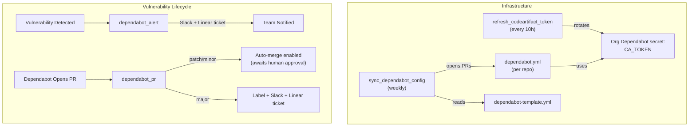
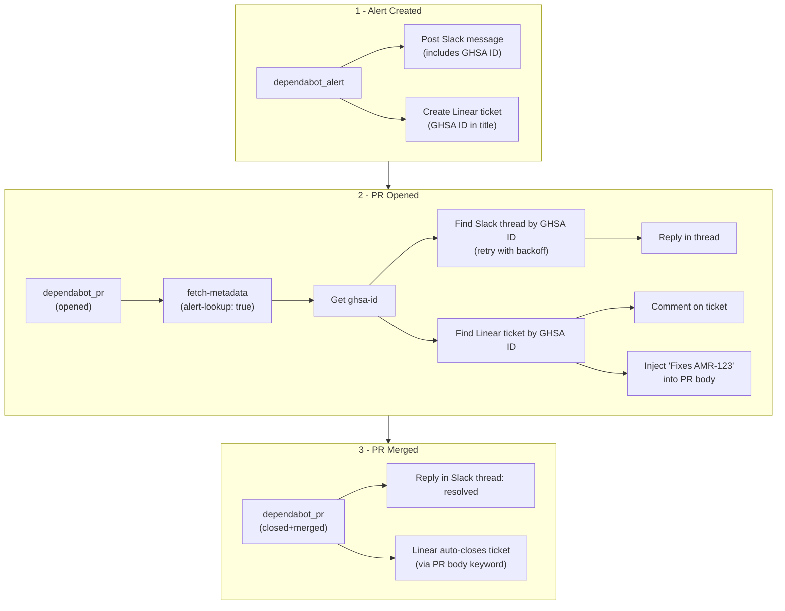
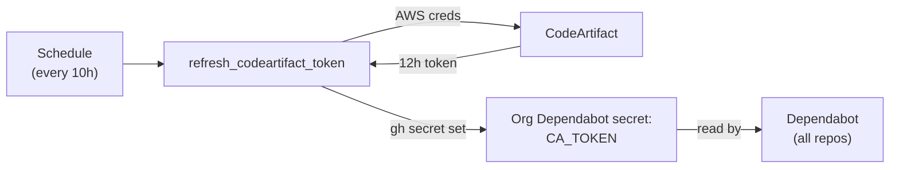
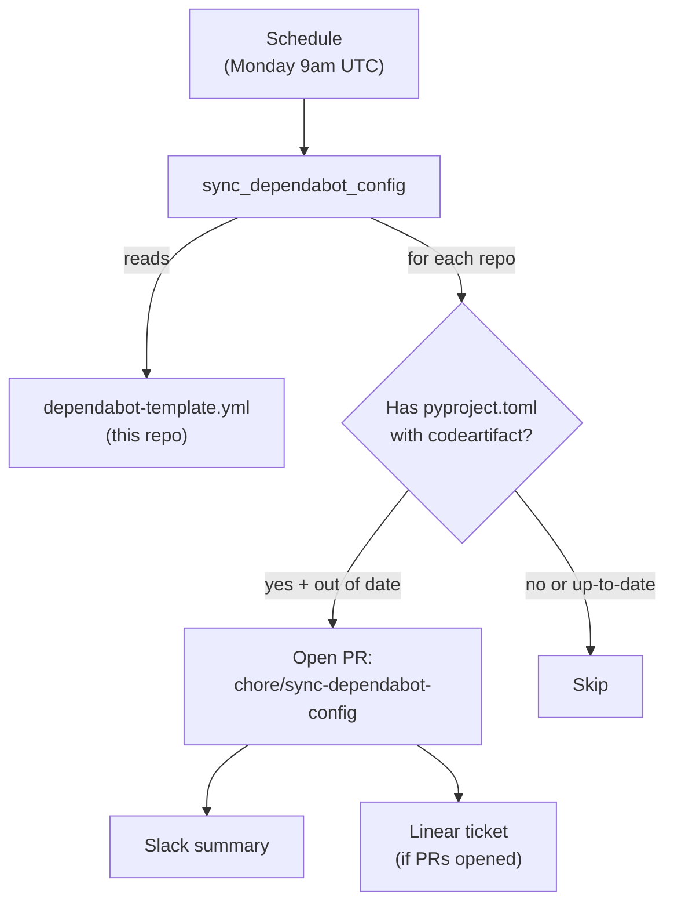

# .github

Organization-level GitHub configuration for Amera, including PR templates, contribution guidelines, and reusable workflows.

## Dependabot Workflows

Four workflows that cover the full Dependabot vulnerability lifecycle plus the infrastructure that keeps it working with private CodeArtifact packages.

**Overview**


**Vulnerability lifecycle (detailed)**


### Prerequisites

**GitHub App (AMERABOT)** — used by all workflows for elevated permissions.

1. Create a GitHub App in the `amera-apps` org with these permissions:
   - **Dependabot alerts:** Read-only (for `alert-lookup` in `fetch-metadata`)
   - **Organization Dependabot secrets:** Read and write (for `refresh_codeartifact_token`)
   - **Contents:** Read and write (for `sync_dependabot_config` to create branches and commit files)
   - **Pull requests:** Read and write (for `sync_dependabot_config` to open PRs)
2. Install it on all repos
3. Store as org-level secrets: `AMERABOT_APP_ID` and `AMERABOT_APP_PRIVATE_KEY`

**Slack bot scopes** — the bot needs `chat:write` (already required) plus `channels:history` (public channels) or `groups:history` (private channels) for thread lookup.

**Org secrets** — sensitive credentials, set at the org level so all repos inherit them:

| Secret | Description |
|---|---|
| `SLACK_BOT_TOKEN` | Slack bot token (`chat:write` + `channels:history` scopes) |
| `LINEAR_API_KEY` | Linear API key for ticket creation and search |
| `AMERABOT_APP_ID` | GitHub App ID |
| `AMERABOT_APP_PRIVATE_KEY` | GitHub App private key |
| `AWS_ACCESS_KEY_ID` | IAM user for CodeArtifact token generation |
| `AWS_SECRET_ACCESS_KEY` | IAM user for CodeArtifact token generation |

The AWS IAM user should have minimal permissions: `codeartifact:GetAuthorizationToken` and `sts:GetServiceLinkedRoleDeletionStatus`.

**Org variables** — non-sensitive defaults. All workflow inputs fall back to these when not explicitly provided by the caller, so most repos don't need to pass them.

| Variable | Description |
|---|---|
| `SLACK_PROJ_COMPLIANCE_CHANNEL_ID` | Default Slack channel for Dependabot notifications |
| `LINEAR_AMERA_TEAM_ID` | Default Linear team for vulnerability tickets |
| `LINEAR_SOC2_COMPLIANCE_PROJECT_ID` | Default Linear project for vulnerability tickets |
| `AWS_REGION` | AWS region for CodeArtifact (`us-east-1`) |
| `AWS_OWNER_ID` | AWS account ID / domain owner for CodeArtifact (`371568547021`) |

Repos can override any default by passing the corresponding input in the caller workflow.

### Dependabot Alert

[`.github/workflows/dependabot_alert.yml`](.github/workflows/dependabot_alert.yml)

**Phase 1:** Fires when a vulnerability alert is created. Posts a Slack message and creates a Linear ticket, both containing the GHSA ID so downstream workflows can find them.

| Input | Required | Fallback variable | Description |
|---|---|---|---|
| `slack-channel-id` | No | `SLACK_PROJ_COMPLIANCE_CHANNEL_ID` | Slack channel ID |
| `linear-team-id` | No | `LINEAR_AMERA_TEAM_ID` | Linear team ID |
| `linear-project-id` | No | `LINEAR_SOC2_COMPLIANCE_PROJECT_ID` | Linear project ID |

| Secret | Required | Description |
|---|---|---|
| `slack-bot-token` | No | Slack bot token |
| `linear-api-key` | No | Linear API key |

#### Usage

Minimal — uses org variable defaults:

```yaml
# .github/workflows/dependabot_alert.yml
name: Dependabot Alert
on:
  dependabot_alert:
    types: [created]

jobs:
  notify:
    uses: amera-apps/.github/.github/workflows/dependabot_alert.yml@main
    secrets:
      slack-bot-token: ${{ secrets.SLACK_BOT_TOKEN }}
      linear-api-key: ${{ secrets.LINEAR_API_KEY }}
```

With overrides:

```yaml
jobs:
  notify:
    uses: amera-apps/.github/.github/workflows/dependabot_alert.yml@main
    with:
      slack-channel-id: C9999999999
      linear-team-id: different-team-id
      linear-project-id: different-project-id
    secrets:
      slack-bot-token: ${{ secrets.SLACK_BOT_TOKEN }}
      linear-api-key: ${{ secrets.LINEAR_API_KEY }}
```

### Dependabot PR

[`.github/workflows/dependabot_pr.yml`](.github/workflows/dependabot_pr.yml)

**Phases 2 & 3:** Handles PR opened and PR merged events.

**On PR opened:**

- Enables auto-merge for patch/minor updates (waits for human approval + CI)
- Labels major updates with `major-update`
- Finds the Slack thread by GHSA ID (with retry + backoff) and replies in-thread
- Finds the Linear ticket by GHSA ID, adds a comment, and injects `Fixes AMR-123` into the PR body

**On PR merged:**

- Replies in the Slack thread confirming the vulnerability is resolved
- Linear auto-closes the ticket via the `Fixes AMR-123` keyword in the PR body

| Input | Required | Fallback variable | Description |
|---|---|---|---|
| `slack-channel-id` | No | `SLACK_PROJ_COMPLIANCE_CHANNEL_ID` | Slack channel ID |
| `linear-team-id` | No | `LINEAR_AMERA_TEAM_ID` | Linear team ID |

| Secret | Required | Description |
|---|---|---|
| `slack-bot-token` | No | Slack bot token |
| `linear-api-key` | No | Linear API key |
| `gh-app-id` | Yes | GitHub App ID for alert-lookup |
| `gh-app-private-key` | Yes | GitHub App private key |

#### Usage

Minimal — uses org variable defaults:

```yaml
# .github/workflows/dependabot_pr.yml
name: Dependabot PR
on:
  pull_request:
    types: [opened, closed]

jobs:
  triage:
    uses: amera-apps/.github/.github/workflows/dependabot_pr.yml@main
    permissions:
      contents: write
      pull-requests: write
    secrets:
      slack-bot-token: ${{ secrets.SLACK_BOT_TOKEN }}
      linear-api-key: ${{ secrets.LINEAR_API_KEY }}
      gh-app-id: ${{ secrets.AMERABOT_APP_ID }}
      gh-app-private-key: ${{ secrets.AMERABOT_APP_PRIVATE_KEY }}
```

### CodeArtifact Token Refresh

[`.github/workflows/refresh_codeartifact_token.yml`](.github/workflows/refresh_codeartifact_token.yml)

Dependabot needs access to the private CodeArtifact registry to resolve packages like `amera-core` and `amera-workflow`. CodeArtifact tokens expire after 12 hours, so this workflow rotates the token every 10 hours and stores it as an org-level Dependabot secret (`CA_TOKEN`).



Runs on the `aws` self-hosted runner group (AWS CLI is pre-installed). Uses `gh secret set --org --app dependabot` to update the secret without manual encryption.

The workflow also supports `workflow_dispatch` for manual runs if a token needs immediate rotation.

### Dependabot Config Sync

[`.github/workflows/sync_dependabot_config.yml`](.github/workflows/sync_dependabot_config.yml)

Dependabot requires a `.github/dependabot.yml` in each repo — there's no way to inherit it at the org level. This workflow maintains a single template ([`.github/dependabot-template.yml`](.github/dependabot-template.yml)) and syncs it to all repos that need it.



**How it works:**

1. Lists all repos in the org
2. For each non-archived repo, checks if `pyproject.toml` exists and references `codeartifact`
3. Compares the repo's `.github/dependabot.yml` to the template — skips if already matching
4. Skips if an open sync PR already exists from a previous run
5. Creates a branch, commits the template, and opens a PR
6. After processing all repos, posts a Slack summary and creates a Linear ticket listing the PRs

PRs are opened (not direct pushes) to comply with branch protection rules requiring at least one approving review.

#### Skipping repos

Some repos may need a custom `dependabot.yml` or should be excluded entirely. Add them to the `skipRepos` array at the top of the `actions/github-script` block in `sync_dependabot_config.yml`:

```javascript
const skipRepos = ['some-special-repo', 'another-exception']
```

Skipped repos appear in the workflow run log for auditability.

#### Updating the template

To change the Dependabot config across all repos:

1. Edit [`.github/dependabot-template.yml`](.github/dependabot-template.yml) in this repo
2. Merge to `main`
3. Wait for the next scheduled sync (Monday 9am UTC) or trigger manually via `workflow_dispatch`
4. Review and merge the PRs opened in each repo
