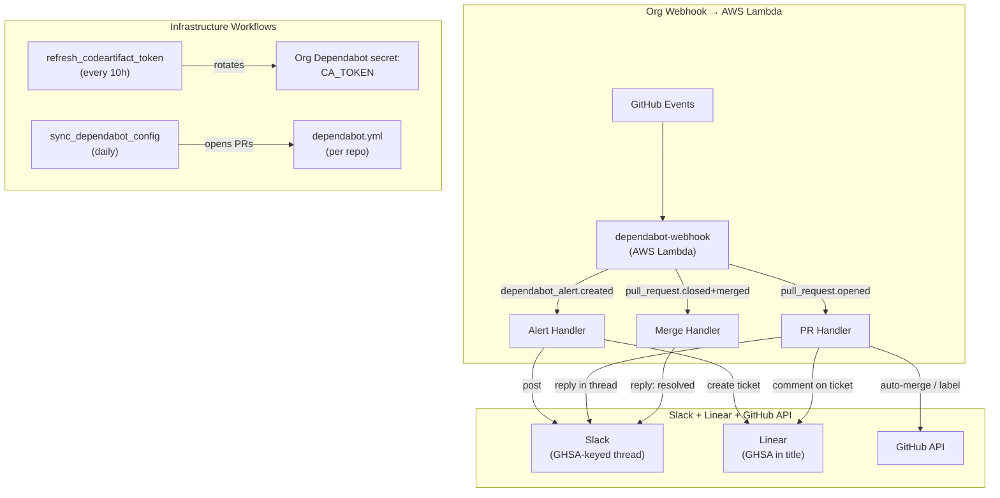
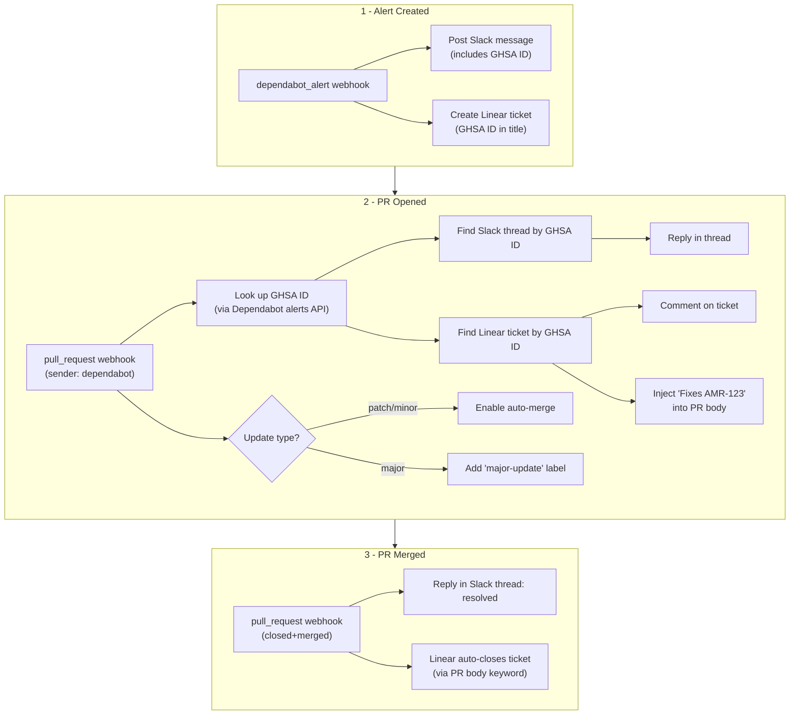
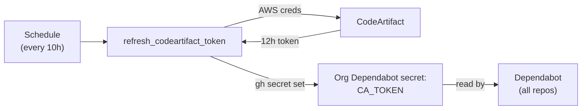
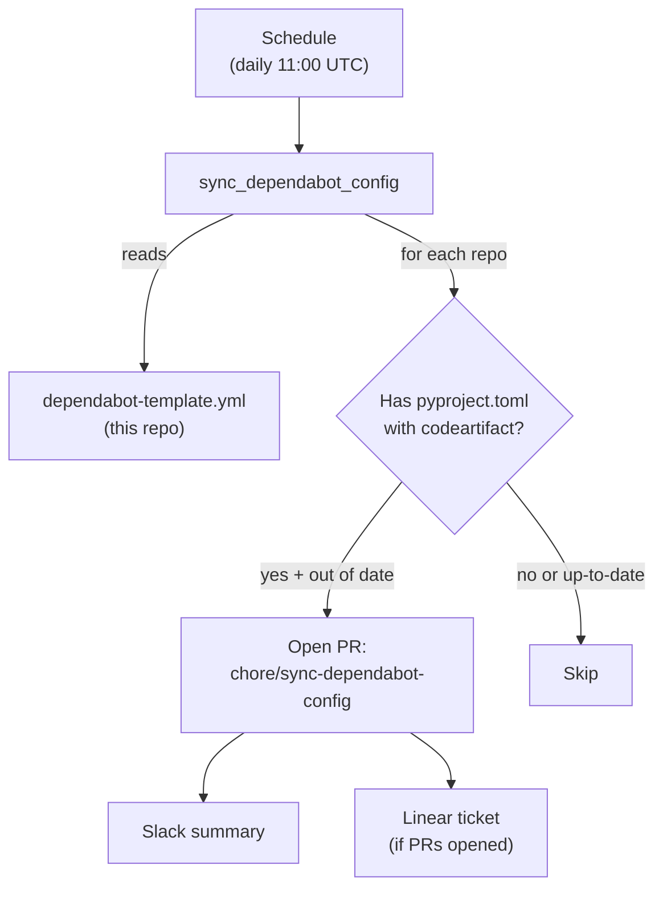

# .github

Organization-level GitHub configuration for Amera, including PR templates, reusable workflows, and Dependabot automation.

## Dependabot Automation

Automated vulnerability lifecycle management across all org repos, combining an [AWS Lambda webhook handler](https://github.com/amera-apps/infra/tree/main/aws/lambda/dependabot) for real-time event handling with GitHub Actions workflows for infrastructure maintenance.

**Overview**


**Vulnerability lifecycle (detailed)**


### Prerequisites

**GitHub App (AMERABOT)** — used by the Lambda for GitHub API calls (auto-merge, labels, alert lookup, PR edits) and by workflows for elevated permissions.

1. Create a GitHub App in the `amera-apps` org with these permissions:
   - **Dependabot alerts:** Read-only
   - **Organization Dependabot secrets:** Read and write (for `refresh_codeartifact_token`)
   - **Contents:** Read and write (for `sync_dependabot_config`)
   - **Pull requests:** Read and write (for `sync_dependabot_config` and the Lambda)
2. Install it on all repos
3. Note the **installation ID** from `https://github.com/organizations/amera-apps/settings/installations`

**Org webhook** — delivers `dependabot_alert` and `pull_request` events to the Lambda.

1. Go to org Settings → Webhooks → Add webhook
2. Payload URL: the Lambda's function URL or API Gateway endpoint
3. Content type: `application/json`
4. Secret: a strong random string (same value stored as `GITHUB_WEBHOOK_SECRET` in the Lambda)
5. Events: select **Dependabot alerts** and **Pull requests**

**Slack bot scopes** — `chat:write` plus `channels:history` (public) or `groups:history` (private) for thread lookup.

**Org secrets** (for GitHub Actions workflows only):

| Secret | Description |
|---|---|
| `AMERABOT_APP_ID` | GitHub App ID |
| `AMERABOT_APP_PRIVATE_KEY` | GitHub App private key |
| `AWS_ACCESS_KEY_ID` | IAM user for CodeArtifact token generation |
| `AWS_SECRET_ACCESS_KEY` | IAM user for CodeArtifact token generation |

The AWS IAM user should have minimal permissions: `codeartifact:GetAuthorizationToken` and `sts:GetServiceLinkedRoleDeletionStatus`.

**Org variables** (for GitHub Actions workflows only):

| Variable | Description |
|---|---|
| `SLACK_PROJ_COMPLIANCE_CHANNEL_ID` | Slack channel (used by `sync_dependabot_config`) |
| `LINEAR_AMERA_TEAM_ID` | Linear team (used by `sync_dependabot_config`) |
| `LINEAR_SOC2_COMPLIANCE_PROJECT_ID` | Linear project (used by `sync_dependabot_config`) |
| `AWS_REGION` | AWS region for CodeArtifact (`us-east-1`) |
| `AWS_OWNER_ID` | AWS account ID / domain owner (`371568547021`) |

### Dependabot Webhook Handler

The webhook handler is deployed as an AWS Lambda. Source, configuration, and deployment instructions live in [`infra/aws/lambda/dependabot/`](https://github.com/amera-apps/infra/tree/main/aws/lambda/dependabot).

### CodeArtifact Token Refresh

[`.github/workflows/refresh_codeartifact_token.yml`](.github/workflows/refresh_codeartifact_token.yml)

Dependabot needs access to the private CodeArtifact registry to resolve packages like `amera-core` and `amera-workflow`. CodeArtifact tokens expire after 12 hours, so this workflow rotates the token every 10 hours and stores it as an org-level Dependabot secret (`CA_TOKEN`).



Runs on the `aws` self-hosted runner group (AWS CLI is pre-installed). Uses `gh secret set --org --app dependabot` to update the secret without manual encryption.

The workflow also supports `workflow_dispatch` for manual runs if a token needs immediate rotation.

### Dependabot Config Sync

[`.github/workflows/sync_dependabot_config.yml`](.github/workflows/sync_dependabot_config.yml)

Dependabot requires a `.github/dependabot.yml` in each repo — there's no way to inherit it at the org level. This workflow maintains a single template ([`.github/dependabot-template.yml`](.github/dependabot-template.yml)) and syncs it to all repos that need it.



**How it works:**

1. Lists all repos in the org
2. For each non-archived repo, checks if `pyproject.toml` exists and references `codeartifact`
3. Compares the repo's `.github/dependabot.yml` to the template — skips if already matching
4. Skips if an open sync PR already exists from a previous run
5. Creates a branch, commits the template, and opens a PR
6. After processing all repos, posts a Slack summary and creates a Linear ticket listing the PRs

PRs are opened (not direct pushes) to comply with branch protection rules requiring at least one approving review.

#### Skipping repos

Some repos may need a custom `dependabot.yml` or should be excluded entirely. Add them to the `skipRepos` array at the top of the `actions/github-script` block in `sync_dependabot_config.yml`:

```javascript
const skipRepos = ['some-special-repo', 'another-exception']
```

Skipped repos appear in the workflow run log for auditability.

#### Updating the template

To change the Dependabot config across all repos:

1. Edit [`.github/dependabot-template.yml`](.github/dependabot-template.yml) in this repo
2. Merge to `main`
3. Wait for the next scheduled sync or trigger manually via `workflow_dispatch`
4. Review and merge the PRs opened in each repo
