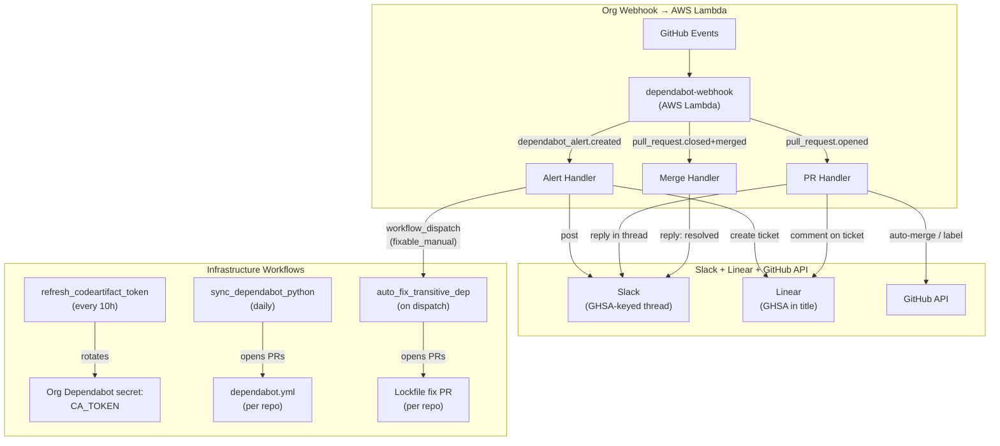
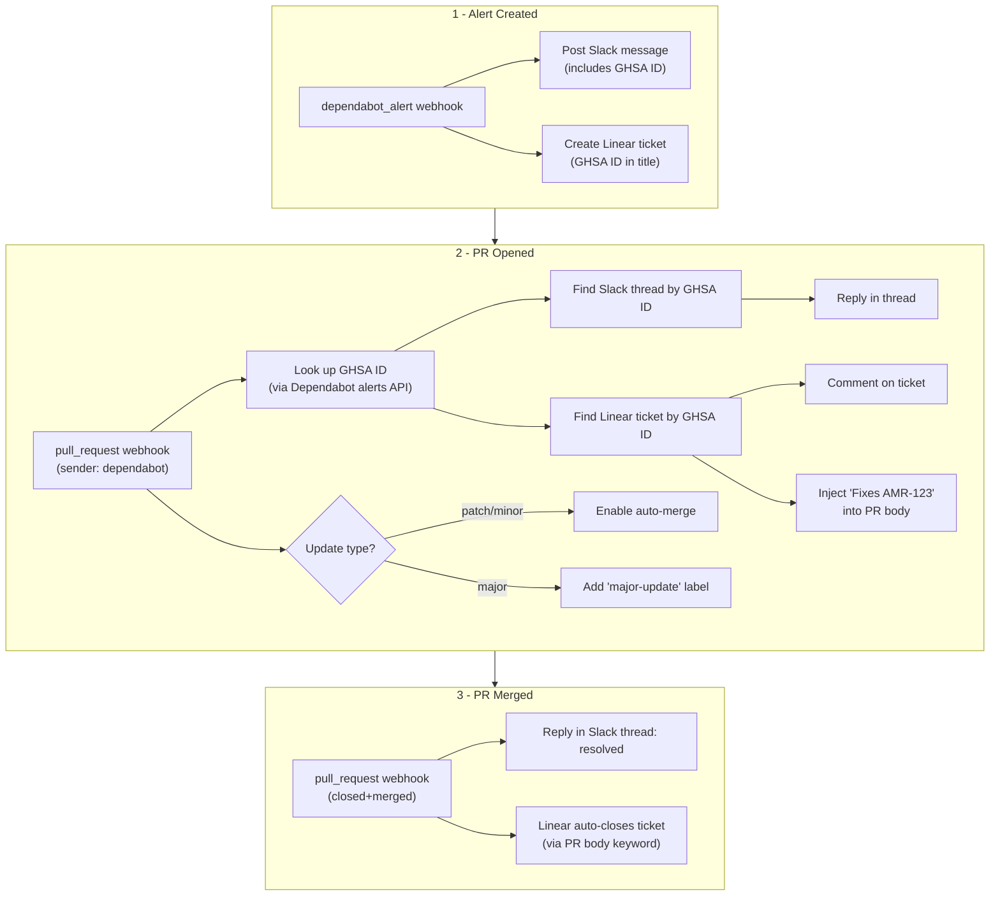
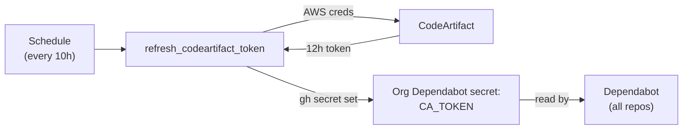
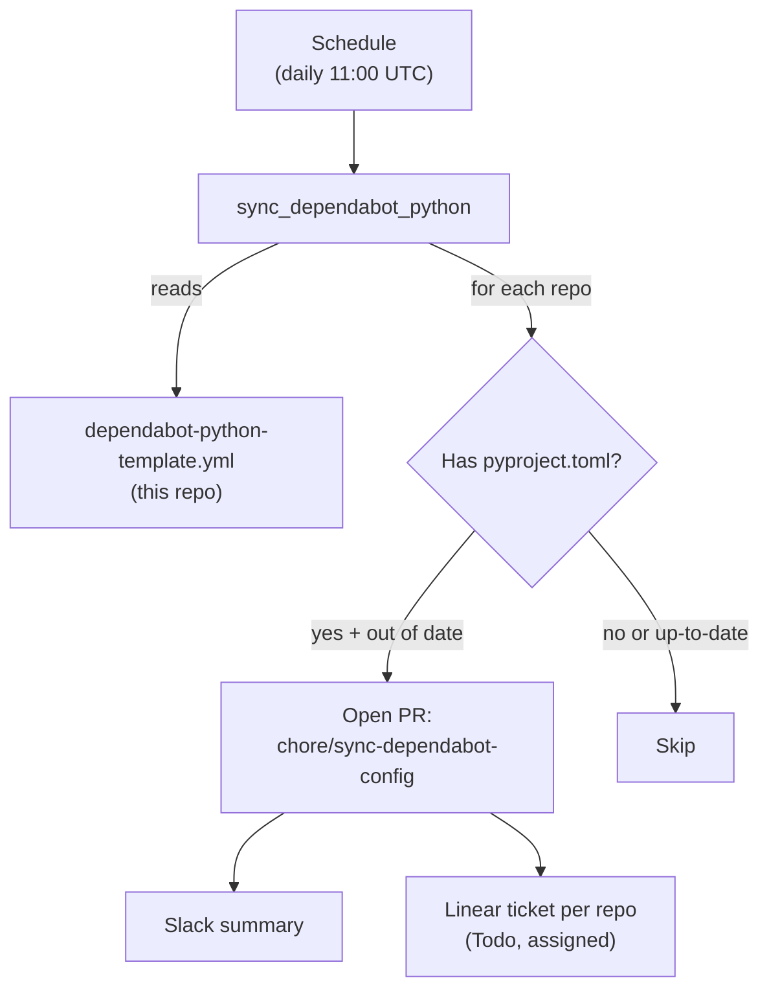
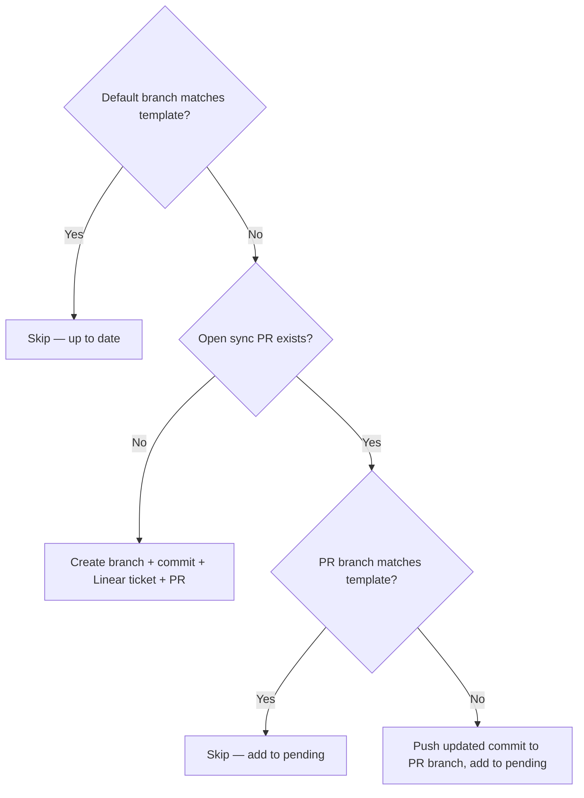
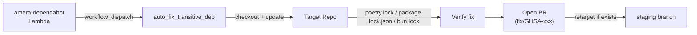

# .github

Organization-level GitHub configuration for Amera, including PR templates, reusable workflows, and Dependabot automation.

## Dependabot Automation

Automated vulnerability lifecycle management across all org repos, combining an [AWS Lambda webhook handler](https://github.com/amera-apps/infra/tree/main/aws/lambda/dependabot) for real-time event handling with GitHub Actions workflows for infrastructure maintenance.

**Overview**


**Vulnerability lifecycle (detailed)**


### Prerequisites

**GitHub App (AMERABOT)** — used by the Lambda for GitHub API calls (auto-merge, labels, alert lookup, PR edits) and by workflows for elevated permissions.

1. Create a GitHub App in the `amera-apps` org with these permissions:
   - **Dependabot alerts:** Read-only
   - **Organization Dependabot secrets:** Read and write (for `refresh_codeartifact_token`)
   - **Contents:** Read and write (for `sync_dependabot_python`)
   - **Pull requests:** Read and write (for `sync_dependabot_python` and the Lambda)
   - **Actions:** Read and write (for `auto_fix_transitive_dep`)
2. Install it on all repos
3. Note the **installation ID** from `https://github.com/organizations/amera-apps/settings/installations`

**Org webhook** — delivers `dependabot_alert` and `pull_request` events to the Lambda.

1. Go to org Settings → Webhooks → Add webhook
2. Payload URL: the Lambda's function URL or API Gateway endpoint
3. Content type: `application/json`
4. Secret: a strong random string (same value stored as `GITHUB_WEBHOOK_SECRET` in the Lambda)
5. Events: select **Dependabot alerts** and **Pull requests**

**Slack bot scopes** — `chat:write` plus `channels:history` (public) or `groups:history` (private) for thread lookup.

**Org secrets** (for GitHub Actions workflows only):

| Secret | Description |
|---|---|
| `AMERABOT_APP_ID` | GitHub App ID |
| `AMERABOT_APP_PRIVATE_KEY` | GitHub App private key |
| `LINEAR_API_KEY` | Linear API key (used by `sync_dependabot_python` to create tickets) |
| `SLACK_BOT_TOKEN` | Slack Bot User OAuth Token (used by `sync_dependabot_python` to post summaries) |
| `ANTHROPIC_API_KEY` | Anthropic API key (used by `sync_dependabot_python` for LLM-based assignee resolution) |
| `AWS_ACCESS_KEY_ID` | IAM user for CodeArtifact token generation |
| `AWS_SECRET_ACCESS_KEY` | IAM user for CodeArtifact token generation |

The AWS IAM user should have minimal permissions: `codeartifact:GetAuthorizationToken` and `sts:GetServiceLinkedRoleDeletionStatus`.

**Org variables** (for GitHub Actions workflows only):

| Variable | Description |
|---|---|
| `SLACK_DEPENDABOT_ALERTS_CHANNEL_ID` | Slack channel (used by `sync_dependabot_python`) |
| `LINEAR_TEAM_ID__AMERA` | Linear team (used by `sync_dependabot_python`) |
| `LINEAR_PROJECT_ID__SOC2_COMPLIANCE` | Linear project (used by `sync_dependabot_python`) |
| `LINEAR_STATE_ID__TO_DO` | Linear "Todo" workflow state — tickets land here assigned and ready to act on |
| `LINEAR_PERSON_ID__NAURAS_J` | Linear user ID — fallback assignee when LLM resolution fails |
| `LINEAR_LABEL_ID__AMERABOT` | Linear label ID — tags tickets as bot-created |
| `AWS_REGION` | AWS region for CodeArtifact (`us-east-1`) |
| `AWS_OWNER_ID` | AWS account ID / domain owner (`371568547021`) |

### Dependabot Webhook Handler

The webhook handler is deployed as an AWS Lambda. Source, configuration, and deployment instructions live in [`infra/aws/lambda/dependabot/`](https://github.com/amera-apps/infra/tree/main/aws/lambda/dependabot).

### CodeArtifact Token Refresh

[`.github/workflows/refresh_codeartifact_token.yml`](.github/workflows/refresh_codeartifact_token.yml)

Dependabot needs access to the private CodeArtifact registry to resolve packages like `amera-core` and `amera-workflow`. CodeArtifact tokens expire after 12 hours, so this workflow rotates the token every 10 hours and stores it as an org-level Dependabot secret (`CA_TOKEN`).



Runs on the `aws` self-hosted runner group (AWS CLI is pre-installed). Uses `gh secret set --org --app dependabot` to update the secret without manual encryption.

The workflow also supports `workflow_dispatch` for manual runs if a token needs immediate rotation.

### Dependabot Config Sync (Python)

[`.github/workflows/sync_dependabot_python.yml`](.github/workflows/sync_dependabot_python.yml)

Dependabot requires a `.github/dependabot.yml` in each repo — there's no way to inherit it at the org level. This workflow maintains a single template ([`.github/dependabot-python-template.yml`](.github/dependabot-python-template.yml)) and syncs it to all Python repos (any repo with a `pyproject.toml` in the root).



**Per-repo decision flow:**



After processing all repos, posts a Slack summary and creates one Linear ticket per repo for each new PR opened.

PRs are opened (not direct pushes) to comply with branch protection rules requiring at least one approving review.

#### Auto-assignment

Each new PR and Linear ticket is automatically assigned to the project lead inferred via an LLM (Claude Haiku). The workflow fetches [`project-mapping.md`](https://github.com/amera-apps/.cursor/blob/main/skills/amera-index/references/project-mapping.md) and [`person-reference.md`](https://github.com/amera-apps/.cursor/blob/main/skills/amera-index/references/person-reference.md) from the `.cursor` repo, queries Linear for project leads, and passes all three data sources to Claude to resolve the best assignee for each repo. If no confident match is found or the `ANTHROPIC_API_KEY` secret is not set, assignment falls back to `LINEAR_PERSON_ID__NAURAS_J`.

#### Skipping repos

Some repos may need a custom `dependabot.yml` or should be excluded entirely. Add them to the `skipRepos` array at the top of the `actions/github-script` block in `sync_dependabot_python.yml`:

```javascript
const skipRepos = ['some-special-repo', 'another-exception']
```

Skipped repos appear in the workflow run log for auditability.

#### Updating the template

To change the Dependabot config across all repos:

1. Edit [`.github/dependabot-python-template.yml`](.github/dependabot-python-template.yml) in this repo
2. Merge to `main`
3. Wait for the next scheduled sync or trigger manually via `workflow_dispatch`
4. Review and merge the PRs opened in each repo

If repos already have open sync PRs from a previous run, the workflow pushes an updated commit to those PRs automatically — no need to close and re-run.

### Auto-fix Transitive Dependencies

[`.github/workflows/auto_fix_transitive_dep.yml`](.github/workflows/auto_fix_transitive_dep.yml)

When the [amera-dependabot Lambda](https://github.com/amera-apps/infra/tree/main/aws/lambda/amera-dependabot) classifies a Dependabot alert as `fixable_manual` (a transitive dependency vulnerability that Dependabot can't fix on its own), it dispatches this workflow via `workflow_dispatch`. The workflow checks out the target repo, runs `poetry update` (pip), `npm update` (npm), or `bun update` (bun) for the vulnerable package, verifies the fix with `pip-audit` / `npm audit`, and opens a PR with security metadata. If the target repo has a `staging` branch, the PR is retargeted to it.



**Workflow inputs:**

| Input | Required | Description |
|-------|----------|-------------|
| `target_repo` | Yes | Repo name (short, not full_name) to fix |
| `packages` | Yes | Space-separated package names to update |
| `ecosystem` | Yes | Package ecosystem (`pip`, `npm`, or `bun`) |
| `ghsa_ids` | Yes | GHSA ID(s) for branch name and PR metadata |
| `severity` | Yes | Alert severity (`critical`, `high`, `medium`, `low`) |
| `linear_ticket` | No | Linear ticket identifier (e.g. `AMR-123`) |
| `alert_url` | No | GitHub Dependabot alert URL |

CodeArtifact authentication is handled inline — the workflow generates a fresh token using the same AWS credentials as `refresh_codeartifact_token` rather than depending on the Dependabot-scoped `CA_TOKEN` secret.
