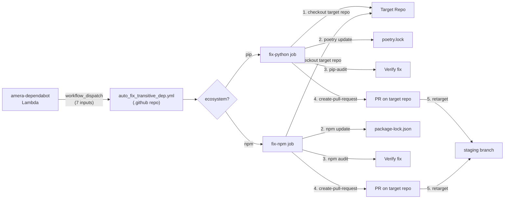

# Design: AMR-1897 — Create auto-fix transitive dependency workflow

## Approach

Create a single workflow file with two ecosystem-gated jobs (`fix-python`, `fix-npm`) following the same patterns as the existing `sync_dependabot_python.yml` and `refresh_codeartifact_token.yml` workflows. The workflow is triggered via `workflow_dispatch` by the amera-dependabot Lambda and runs entirely within the `.github` repo — it checks out the target repo, updates the vulnerable package, and opens a PR using the AMERABOT app token.

CodeArtifact authentication is handled inline (same pattern as `refresh_codeartifact_token.yml`) rather than using the Dependabot-scoped `CA_TOKEN` secret. This makes the workflow self-contained with no coupling to the token refresh cadence.

## Architecture



The workflow lives alongside the existing workflows in `.github/workflows/` and reuses the same org secrets and variables. The Lambda dispatches it when it classifies an alert as `fixable_manual`, passing metadata as workflow inputs.

## Key Files

| File | Action | Description |
|------|--------|-------------|
| `.github/workflows/auto_fix_transitive_dep.yml` | Create | The new workflow — two jobs, seven inputs, full lifecycle from checkout to PR |
| `README.md` | Modify | Add "Auto-fix Transitive Dependencies" section, update overview diagram |

## Workflow Structure

### Inputs

All seven inputs passed via `workflow_dispatch`:

| Input | Required | Type | Example |
|-------|----------|------|---------|
| `target_repo` | yes | string | `yuzu-service` |
| `packages` | yes | string | `aiohttp` (space-separated for multiple) |
| `ecosystem` | yes | string | `pip` or `npm` |
| `ghsa_ids` | yes | string | `GHSA-xxxx-yyyy-zzzz` |
| `severity` | yes | string | `critical`, `high`, `medium`, `low` |
| `linear_ticket` | no | string | `AMR-123` |
| `alert_url` | no | string | Full GitHub Dependabot alert URL |

### Concurrency

```yaml
concurrency:
  group: auto-fix-${{ inputs.target_repo }}-${{ inputs.ghsa_ids }}
  cancel-in-progress: false
```

Keyed on `{target_repo}-{ghsa_ids}` so webhook retries for the same alert don't spawn duplicate runs, but different GHSAs for the same repo run independently. `cancel-in-progress: false` ensures the first run completes.

### Job: `fix-python`

Gated on `inputs.ecosystem == 'pip'`. Step sequence:

1. **Generate AMERABOT token** — `actions/create-github-app-token@v3`, scoped to `inputs.target_repo` via the `repositories` parameter (pattern from `sync_dependabot_python.yml`, but scoped to a single repo instead of the whole org)
2. **Checkout target repo** — `actions/checkout@v5` with `repository: amera-apps/${{ inputs.target_repo }}`
3. **Setup Python** — `actions/setup-python@v5` with `python-version: '3.11'`
4. **Install Poetry** — `pipx install poetry`
5. **Configure AWS credentials** — `aws-actions/configure-aws-credentials@v6` using existing org secrets `AWS_ACCESS_KEY_ID`, `AWS_SECRET_ACCESS_KEY`, and variable `AWS_REGION` (same pattern as `refresh_codeartifact_token.yml`)
6. **Get CodeArtifact token** — `aws codeartifact get-authorization-token` inline, masking the token (same pattern as `refresh_codeartifact_token.yml` steps `ca`)
7. **Authenticate Poetry** — Add the CodeArtifact source and configure credentials using the inline token
8. **Install dependencies** — `poetry install --no-interaction`
9. **Update vulnerable packages** — `poetry update ${{ inputs.packages }} --no-interaction`, check `git diff --quiet poetry.lock` to set `changed` output
10. **Verify with pip-audit** — `pip-audit` with `continue-on-error: true` (informational only, gated on `changed == 'true'`)
11. **Create PR** — `peter-evans/create-pull-request@v7` (gated on `changed == 'true'`)
12. **Retarget to staging** — Check if `staging` branch exists via `gh api`, retarget if so (with `continue-on-error: true`)
13. **Assignee placeholder** — Stub step for future auto-assignment (with `continue-on-error: true`)

### Job: `fix-npm`

Gated on `inputs.ecosystem == 'npm'`. Same structure as `fix-python` but with npm tooling:

1. **Generate AMERABOT token** — Same as Python job
2. **Checkout target repo** — Same
3. **Setup Node** — `actions/setup-node@v4` with `node-version: '20'`
4. **Update vulnerable packages** — `npm update ${{ inputs.packages }}`, check `git diff --quiet package-lock.json`
5. **Verify with npm audit** — `npm audit` with `continue-on-error: true`
6. **Create PR** — Same `peter-evans/create-pull-request@v7` config
7. **Retarget to staging** — Same pattern
8. **Assignee placeholder** — Same stub

### PR Template

Both jobs use identical PR metadata:

```
Branch:  fix/{ghsa_ids}
Title:   fix: update {packages} ({ghsa_ids})
Commit:  fix: update {packages} to resolve {ghsa_ids}
Labels:  security, automated-fix
```

Body includes:
- Severity badge
- Package name + advisory link
- Provenance (links to amera-dependabot Lambda and this workflow)
- Reviewer instructions (review lockfile, confirm CI, merge)
- Linear ticket reference via `Resolves {linear_ticket}` (conditional on input being present)

### CodeArtifact Auth Pattern

Adapting the proven pattern from `refresh_codeartifact_token.yml`:

```yaml
- name: Configure AWS credentials
  uses: aws-actions/configure-aws-credentials@v6
  with:
    aws-access-key-id: ${{ secrets.AWS_ACCESS_KEY_ID }}
    aws-secret-access-key: ${{ secrets.AWS_SECRET_ACCESS_KEY }}
    aws-region: ${{ vars.AWS_REGION }}

- name: Get CodeArtifact token
  id: ca
  run: |
    set -euo pipefail
    TOKEN="$(aws codeartifact get-authorization-token \
      --domain amera-artifacts \
      --domain-owner ${{ vars.AWS_OWNER_ID }} \
      --region "${{ vars.AWS_REGION }}" \
      --query authorizationToken --output text)"
    echo "::add-mask::$TOKEN"
    echo "token=$TOKEN" >> "$GITHUB_OUTPUT"

- name: Authenticate Poetry
  run: |
    poetry source add --priority=supplemental codeartifact \
      https://amera-artifacts-371568547021.d.codeartifact.us-east-1.amazonaws.com/pypi/amera-python/simple/
    poetry config http-basic.codeartifact aws "${{ steps.ca.outputs.token }}"
```

This avoids depending on the Dependabot-scoped `CA_TOKEN` secret and reuses credentials already available to Actions workflows.

## Edge Cases

| Case | Handling |
|------|----------|
| Package update doesn't change lockfile | `git diff --quiet` check skips PR creation; Linear sub-ticket remains open for manual investigation |
| `pip-audit` / `npm audit` still reports vulnerabilities after update | `continue-on-error: true` — PR is still created; audit output is visible in the workflow logs for debugging |
| Branch `fix/{ghsa_id}` already exists | `peter-evans/create-pull-request` is idempotent — updates the existing PR rather than creating a duplicate |
| Lambda dispatches the same alert twice (webhook retry) | Concurrency group `auto-fix-{target_repo}-{ghsa_ids}` with `cancel-in-progress: false` ensures only one run completes |
| Target repo has no `staging` branch | Retarget step checks via `gh api` and silently skips with `continue-on-error: true` |
| CodeArtifact token generation fails | Job fails and the run is visible in the Actions tab; Lambda sub-ticket remains open |
| Multiple space-separated packages | `poetry update pkg1 pkg2` / `npm update pkg1 pkg2` handles multiple packages natively |

## Dependencies

| Dependency | Type | Notes |
|------------|------|-------|
| `actions/create-github-app-token@v3` | Action | Generates scoped AMERABOT token |
| `actions/checkout@v5` | Action | Already used by existing workflows |
| `actions/setup-python@v5` | Action | For Poetry/pip |
| `actions/setup-node@v4` | Action | For npm |
| `aws-actions/configure-aws-credentials@v6` | Action | Already used by `refresh_codeartifact_token.yml` |
| `peter-evans/create-pull-request@v7` | Action | Handles branch creation, commit, and PR in one step |
| AMERABOT GitHub App | Service | Needs `actions: write` and `contents: write` permissions (prerequisite, done in GitHub UI) |
| amera-dependabot Lambda | Service | AMR-1652 Phase 1 — provides the `workflow_dispatch` trigger (not part of this ticket) |

## Infrastructure Changes

| Change | Description | Timing |
|--------|-------------|--------|
| AMERABOT App permissions | Add `actions: write` permission so the Lambda can trigger `workflow_dispatch`. Ensure `contents: write` is granted for all repos (needed for the workflow to push branches). | Before Lambda-side dispatch is enabled (AMR-1652 Phase 1) |

No new secrets or org variables are needed — the workflow reuses `AMERABOT_APP_ID`, `AMERABOT_APP_PRIVATE_KEY`, `AWS_ACCESS_KEY_ID`, `AWS_SECRET_ACCESS_KEY`, `AWS_REGION`, and `AWS_OWNER_ID`, all of which are already configured.

## README Changes

Add a new `### Auto-fix Transitive Dependencies` section after the existing "Dependabot Config Sync (Python)" section. Include:

1. Link to the workflow file
2. One-paragraph description of what it does and how it's triggered
3. Mermaid diagram showing the Lambda-to-workflow-to-PR flow
4. Table of workflow inputs
5. Note about the CodeArtifact auth approach

Update the top-level **Overview** mermaid diagram to add the auto-fix workflow as a third node in the "Infrastructure Workflows" subgraph, connecting it from the AlertHandler via a `workflow_dispatch` edge.

Update the **Prerequisites** section to note the additional AMERABOT permission (`actions: write`).

## Risks & Mitigations

| Risk | Mitigation |
|------|------------|
| Workflow pushes a broken lockfile that causes CI failures in the target repo | The PR is not auto-merged — a human reviewer must approve. `pip-audit` / `npm audit` provides early signal. |
| CodeArtifact token generation adds latency to every run | Tokens are generated inline per run (~2-3s). This is acceptable for a background automation. |
| Rate limiting on workflow_dispatch API | GitHub allows 1,000 dispatches/hour/repo. With ~36 alerts/day average, this is well within limits. |
| AMERABOT token scope is too broad | Token is scoped to a single target repo via the `repositories` parameter, not the entire org. |
| Poetry source configuration leaks into the checked-out repo | Poetry config is written to the runner's home directory, not the repo. `peter-evans/create-pull-request` only commits tracked file changes (lockfile). |
